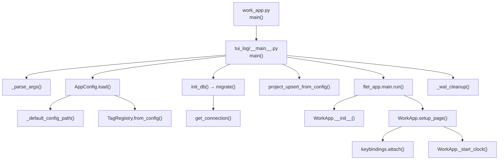
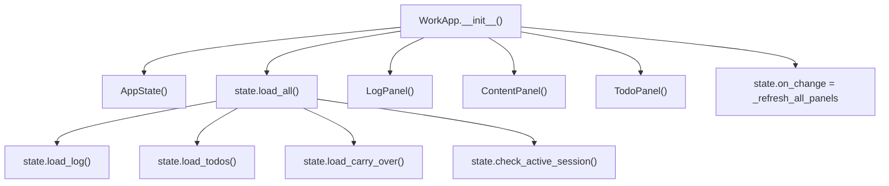
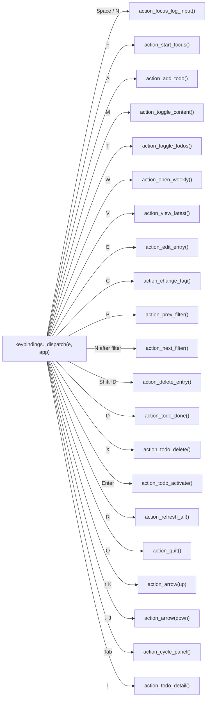
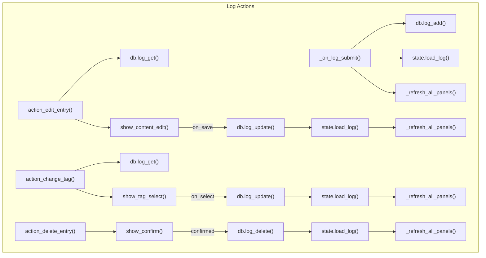
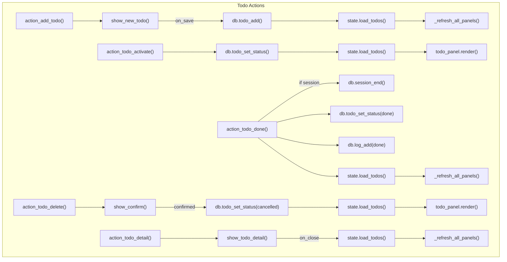
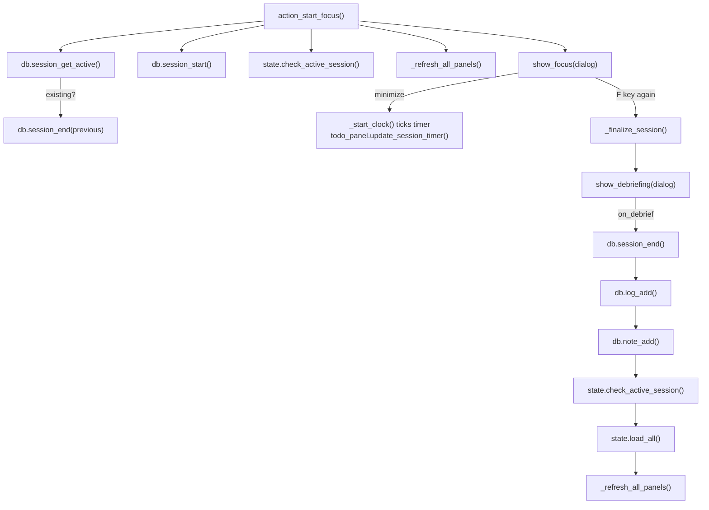
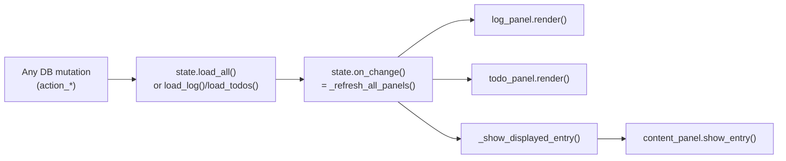
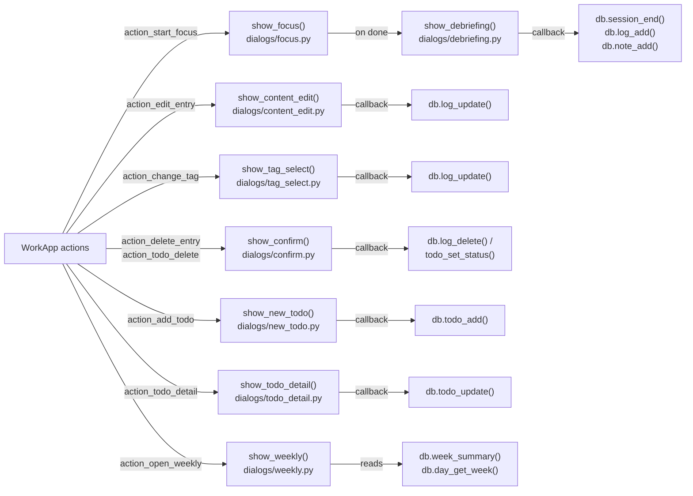

# App Call Map

## 1 — Startup Flow

---

## 2 — WorkApp Initialization

---

## 3 — Keybinding Dispatch

---

## 4 — Core Action Flows

---

## 5 — Focus Session Lifecycle

---

## 6 — State & Panel Render Chain

---

## 7 — Database Layer

```mermaid
flowchart TD
    GC["schema.get_connection(db_path)"]

    subgraph LOG_DB ["log_entries"]
        la["log_add()"] --> GC
        lg["log_get()"] --> GC
        lu["log_update()"] --> GC
        ld["log_delete()"] --> GC
        lgd["log_get_day()"] --> GC
        lga["log_get_all()"] --> GC
        lob["log_get_open_blocks()"] --> GC
        lut["log_used_tags()"] --> GC
    end

    subgraph TODO_DB ["todos"]
        ta["todo_add()"] --> GC
        tg["todo_get()"] --> GC
        tl["todo_list()"] --> GC
        tss["todo_set_status()"] --> GC
        tu["todo_update()"] --> GC
        tdl["todo_delete()"] --> GC
    end

    subgraph SESSION_DB ["focus_sessions"]
        sst["session_start()"] --> GC
        sen["session_end()"] --> GC
        sga["session_get_active()"] --> GC
        slt["session_total_today()"] --> GC
    end

    subgraph NOTE_DB ["todo_notes"]
        na["note_add()"] --> GC
        nlft["note_list_for_todo()"] --> GC
        nlfs["note_list_for_session()"] --> GC
    end

    subgraph DAY_DB ["day_meta"]
        dg["day_get()"] --> GC
        dgoc["day_get_or_create()"] --> GC
        dgw["day_get_week()"] --> GC
    end
```

---

## 8 — Dialog Dependencies (WorkApp → show_* → db_*)

